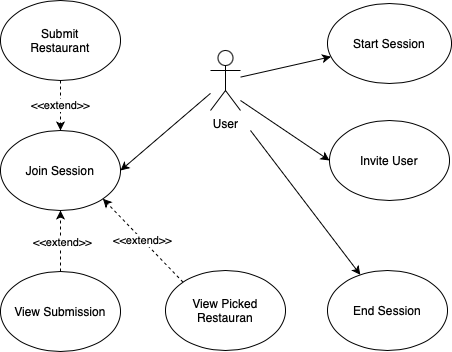
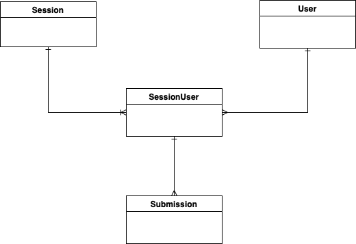

# Introducing DineDecider

DineDecider is a new application for teams to collectively decide on a location to head to for lunch.

## Use Case Diagram



### Description

The use case diagram illustrates the interactions between the users and the system. The key use cases include:

- **Start Session**: A user can start a new session to decide on a lunch location. The user becomes the admin of that session.
- **Invite User**: More users can be invited to a session that is not yet ended.
- **Submit Place**: Users can submit their preferred lunch places.
- **View Submitted Places**: Users are able to see restaurants that others have submitted.
- **View Selected Place**: Users are able to see the restaurant that is ultimately selected.
- **End Session**: The admin can end the session and announce the selected place. Place is selected randomly.

## Domain Diagram



### Description

The domain diagram represents the key entities and their relationships within the system. The main entities include:

- **User**: Represents a user in the system with attributes such as `id`, `name`, and `uuid`.
- **Session**: Represents a session where users can submit and vote on lunch places. Attributes include `id`, `admin`, `status`, and `uuid`.
- **SessionUser**: Represents normalization of the many-to-many relationship between User and Session. Attributes include `id`, `userId`, and `sessionId`.
- **Submission**: Represents a lunch place submitted by users. Attributes include `id`, `placeName`, and whether it is ultimately `selected`.

## API Documentation

There are seven APIs, the start and end would be from SessionController,
`POST /sessions` and `PATCH /sessions/{sessionUuid}` which are to start and end a session respectively.
The full API documentation for this project is available in the OpenAPI/Swagger format.

### OpenAPI/Swagger Specification

- [Download YAML format](src/main/resources/static/docs/api-docs.yaml)


# Installation

## Requirements

The project requires [Java 21].

The project makes use of Maven, Docker, Docker Compose, and PostgreSql.

## Useful Maven commands

The project makes use of Maven to carry some common tasks such as building the project or running test.

### Build the project

Compiles the project, runs the test and then creates an executable JAR file

```console
$ mvn clean install
```

### Run the tests

Run unit tests

```console
$ mvn test
```


## Useful Docker commands

The project makes use of Docker and Docker Compose. The files are located under `docker` folder and the commands listed are to be run from said folder.

### Build application image

```console
$ docker build . -t dinedecider
```

### Run application and database images
```console
$ docker compose up
```

### List containers
```console
$ docker ps
```

### Connect to DB container

```console
$ docker exec -it <<db container name>> bash
```

The project makes use of PostgreSql DB that is run in a docker container.

## Useful PostgreSql commands

Please note that PostgreSql container needs to be up and the commands need to be run from the container.

### Connect to PostgreSQL
```console
$ psql --username dineuser --dbname dinedb
```

### List all tables
```console
$ \dt
```

## API with Swagger UI

Swagger UI is configured on the project.

### Swagger UI URL
```html
http://localhost:8080/swagger-ui/index.html
```